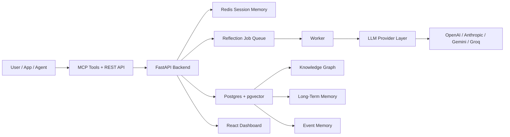

# MemoryOS

<p align="center">
  <strong>Production-grade memory infrastructure for AI agents.</strong><br />
  Session memory, event memory, semantic recall, knowledge graphs, reflection workflows, and a visual dashboard in one stack.
</p>

<p align="center">
  
  
  
  
  
</p>

## What It Is

MemoryOS is an MCP-native memory platform for AI agents, production chatbots, and AI applications that need:

- fast session memory in Redis
- durable long-term memory in PostgreSQL
- semantic similarity search with `pgvector`
- knowledge graph generation and graph exploration
- reflection pipelines that turn raw interactions into reusable memory
- a live dashboard for graph, timeline, docs, and operational visibility

Instead of treating memory like a simple chat history store, MemoryOS is designed to make agents improve over time by learning from prior context, failures, resolutions, and repeated patterns.

## Core Architecture



## Memory Layers

### 1. Session Memory

- stored in Redis
- optimized for low-latency active conversation state
- TTL-based and retrieval-first

### 2. Event Memory

- persistent event trail in Postgres
- captures interactions, tool outputs, outcomes, and feedback

### 3. Knowledge Graph

- stores entities and relationships extracted from conversations and ingested knowledge
- supports graph visualization and graph-assisted retrieval

### 4. Long-Term Memory

- persistent facts, preferences, constraints, failures, resolutions, and retrieval hints
- searchable with semantic similarity through `pgvector`

## Why MemoryOS Is Different

- `MCP-native`
  - agents can use it directly as a memory tool layer
- `semantic + structured`
  - not just keyword search, not just vector blobs
- `reflection-driven`
  - memories evolve from interactions over time
- `graph-aware`
  - relationships are visible, queryable, and explainable
- `production-minded`
  - auth, refresh tokens, RBAC, retries, dead-letter handling, metrics, backups, CI scaffold

## Tech Stack

### Backend

- FastAPI
- PostgreSQL
- pgvector
- Redis
- Prometheus metrics
- Docker Compose

### AI Layer

- EmbeddingGemma for embeddings
- OpenAI, Anthropic, Gemini, or Groq for reflection/reasoning

### Frontend

- React
- Vite
- custom graph UI
- timeline and docs views

## Features

- email/password auth
- access + refresh token flow
- org/app/user RBAC baseline
- admin-only app and API key creation
- MCP-style tool endpoints
- REST APIs for memory, graph, ingestion, jobs, and auth
- async reflection workers
- retry and dead-letter job handling
- semantic search with EmbeddingGemma + pgvector
- graph visualization dashboard
- timeline view for memory evolution
- Prometheus metrics and alert rules
- DB backup and restore scripts

## Quick Start

### 1. Clone the repository

```bash
git clone <your-repo-url> memoryos
cd memoryos
```

### 2. Create environment file

```bash
cp .env.example .env
```

Edit `.env` and set your secrets, especially:

```env
POSTGRES_PASSWORD=strong-db-password
MEMORYOS_JWT_SECRET=very-long-random-secret
MEMORYOS_DEFAULT_PROVIDER=groq
MEMORYOS_GROQ_API_KEY=your_groq_api_key
MEMORYOS_HUGGINGFACE_TOKEN=your_huggingface_token
MEMORYOS_CORS_ORIGINS=https://your-domain.com
```

### 3. Start everything

```bash
docker compose up -d --build
```

### 4. Open the stack

- Dashboard: `http://<host>/`
- API docs: `http://<host>/docs`
- Metrics: `http://<host>/metrics`
- Prometheus: `http://<host>:9090/`

## Running With Groq

If you want Groq for reasoning/reflection:

```env
MEMORYOS_DEFAULT_PROVIDER=groq
MEMORYOS_GROQ_API_KEY=your_groq_api_key
MEMORYOS_GROQ_MODEL=llama-3.3-70b-versatile
```

You still need a Hugging Face token because EmbeddingGemma is used for the embedding layer and semantic retrieval.

## Repository Layout

```text
backend/     FastAPI app, memory engine, auth, providers, workers
frontend/    React dashboard
docs/        architecture notes and runbooks
ops/         Prometheus config and alert rules
scripts/     backup and restore helpers
```

## Operations

- Runbook: [docs/runbook.md](/C:/Users/usama/Downloads/Memory/docs/runbook.md)
- Prometheus config: [ops/prometheus/prometheus.yml](/C:/Users/usama/Downloads/Memory/ops/prometheus/prometheus.yml)
- Alert rules: [ops/prometheus/alerts.yml](/C:/Users/usama/Downloads/Memory/ops/prometheus/alerts.yml)
- Backup script: [scripts/backup-db.sh](/C:/Users/usama/Downloads/Memory/scripts/backup-db.sh)
- Restore script: [scripts/restore-db.sh](/C:/Users/usama/Downloads/Memory/scripts/restore-db.sh)

## Security And Production Notes

- refresh-token auth is enabled
- admin-only app and API key creation is enabled
- rate limiting is enabled
- secure response headers are enabled
- Prometheus alert rules are included
- retry and dead-letter behavior are included for reflection jobs

It is designed to be practical today and extensible tomorrow.
