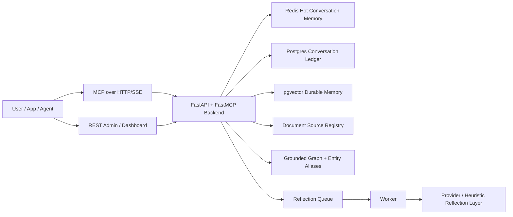

# MemoryOS Enterprise

<p align="center">
  <strong>MCP-first memory and conversation infrastructure for production AI agents.</strong><br />
  Durable tenant conversation history, grounded retrieval, shared memory, reflection, and graph operations in one stack.
</p>

<p align="center">
  
  
  
  
  
</p>

## What It Is

MemoryOS is an MCP-native backend for agents that need more than a chat-history string.

It gives you:

- **MCP-first agent interfaces** over Streamable HTTP and SSE
- **Full tenant conversation ledger** with threads, turns, traces, audits, and tool logs
- **Hot conversation memory** in Redis for active chats
- **Private user memory** that persists across conversations
- **Shared app memory** that lets one agent improve across many users
- **Source-aware ingestion** with durable source identity, chunk provenance, and incremental re-ingest behavior
- **Hybrid retrieval** that combines embeddings, graph expansion, query rewrite, and cross-encoder reranking
- **Append-first graph extraction** with evidence-linked nodes and edges instead of whole-graph rebuilds for normal updates
- **Reflection and promotion workflows** so memory can improve over time instead of only growing

The goal is not "store everything forever and hope retrieval works."

The goal is:

- keep every conversation for auditability
- retrieve the right evidence at answer time
- promote only stable knowledge into reusable memory
- give admins visibility into what the agent learned, why it answered, and where a memory came from

## MCP-First Design

MemoryOS treats MCP as the canonical product surface.

- `/mcp` and `/mcp-sse` are the primary interfaces for agent clients
- REST APIs mirror the same capabilities for dashboards, admin tooling, and non-MCP integrations
- MCP and REST share the same backend service layer, so behavior stays consistent

This means you can plug an agent into MCP, while your ops team still gets normal HTTP APIs for search, review, inspection, and admin control.

## Authentication Model

- The dashboard signs in with workspace email and password and then uses bearer tokens.
- API keys are for MCP clients, automations, and server-to-server requests.
- If you use an API key directly, send it in the `X-API-Key` header instead of the dashboard login flow.

## Core Architecture



## What The System Stores

MemoryOS now has multiple layers with different jobs:

1. **Conversation Hot Memory**
   Stored in Redis.
   Used for the active conversation window and fast turn-to-turn continuity.

2. **Conversation Ledger**
   Stored in Postgres.
   Contains full conversations, turns, messages, retrieval traces, answer audits, and tool invocations.

3. **Event Memory**
   Stored in Postgres.
   Immutable role-based event trail for user and assistant actions.

4. **Document Source Registry**
   Stored in Postgres.
   Tracks durable `source_id`, source fingerprints, parser/chunking state, and whether a source is unchanged, pending reflection, or ready.

5. **User Memory**
   Durable private memory for one end user across many conversations.

6. **App Memory**
   Durable shared memory for the agent across many users in the same tenant/app.

7. **Knowledge Graph**
   Evidence-linked nodes and relations, plus entity alias merging. Graph updates append and merge against the current scope rather than replacing it.

8. **Memory Candidates**
   Reviewable reflection outputs before they become trusted durable memory.

## What Actually Works In This Backend

### MCP Tools

The MCP layer now exposes these runtime and admin tools:

- `start_conversation`
- `send_message`
- `get_conversation`
- `list_conversations`
- `classify_conversation`
- `remember`
- `append_event`
- `recall`
- `search_graph`
- `reflect_conversation`
- `explain_answer`
- `list_memory_candidates`
- `approve_memory_candidate`
- `reject_memory_candidate`
- `merge_entities`
- `rebuild_graph`  (implemented as incremental append/merge from grounded evidence)

### REST Mirrors

The backend also exposes matching HTTP routes for apps and dashboards:

- `POST /api/v1/agents/{agent_id}/conversations`
- `POST /api/v1/conversations/{conversation_id}/messages`
- `GET /api/v1/conversations/{conversation_id}`
- `POST /api/v1/conversations/classify`
- `GET /api/v1/conversations/{conversation_id}/explain`
- `GET /api/v1/admin/tenants/{org_id}/conversations`
- `GET /api/v1/admin/conversations/{conversation_id}/trace`
- `GET /api/v1/admin/memory-candidates`
- `POST /api/v1/admin/memory-candidates/{id}/approve`
- `POST /api/v1/admin/memory-candidates/{id}/reject`
- `POST /api/v1/admin/graph/merge-entities`
- `POST /api/v1/admin/graph/append`
- `POST /api/v1/admin/graph/rebuild`
- `POST /api/v1/memory/ingest`
- `POST /api/v1/memory/ingest/upload`
- `POST /api/v1/memory/graph`
- `POST /api/v1/memory/recall`

## How It Works End To End

### Flow

When a client sends a message through MCP or REST:

1. MemoryOS resolves tenant/app/user scope from the authenticated identity.
2. It loads the active conversation context.
3. It runs retrieval planning across conversation, user, and app memory.
4. It returns a grounded answer using retrieved evidence.
5. It stores the full turn:
   user message, assistant answer, citations, retrieval trace, audit record, and tool log.
6. It appends event records.
7. It queues reflection.
8. Reflection can append graph updates and create reviewable memory candidates.

When a client ingests source material:

1. The source is assigned a durable `source_id`.
2. The content is fingerprinted so unchanged re-ingests can be skipped safely.
3. Chunk memories are upserted by stable `chunk_key` instead of blindly duplicated.
4. If chunks disappear, only the stale graph evidence for those chunk memories is pruned.
5. Reflection runs afterward and marks the touched sources back to `ready`.

### Important Behavior

- If evidence is weak, the answer path prefers uncertainty over confident fabrication.
- App memory can be shared across users in the same app.
- User memory stays private to that user.
- Admins can inspect what happened later through trace and review endpoints.

## Real-Life Examples

### 1. E-commerce Support Agent

Imagine a Shopify support agent for tenant `acme-commerce`.

The user asks:

`"Why was my refund denied?"`

What MemoryOS does:

- looks at the current conversation
- recalls prior private user history like "this customer previously had a chargeback"
- recalls shared app memory like "refunds above $500 require manager approval"
- returns a grounded answer with evidence-backed snippets
- stores the turn in the conversation ledger
- marks the conversation type as something like `billing` or `support`
- later reflection may create a reusable candidate like:
  `Refunds over $500 require manager approval`

Why this matters:

- support leads can inspect the exact thread later
- the agent improves over time for future refund cases
- one user's private issue does not leak to another user

### 2. SaaS Technical Support Agent

A customer asks:

`"Why is the webhook failing with 401 errors?"`

MemoryOS can:

- keep the entire troubleshooting conversation
- retrieve shared app memory like "401 webhook failures usually happen when the signing secret is rotated but the old secret is still configured"
- classify the conversation as `implementation` or `support`
- store the answer trace so an admin can see which memories were used
- create a memory candidate after repeated similar incidents

Over time, the system gets better at recurring incidents because repeated resolutions can move into shared app memory.

### 3. HR Policy Assistant

An employee asks:

`"Can I carry over unused vacation days into next year?"`

MemoryOS:

- recalls the policy document chunk
- can link graph entities like `Vacation Policy`, `Carryover`, and `Employee Handbook`
- cites the relevant memory chunk in the answer
- stores the full thread for tenant admins
- avoids turning a one-off casual preference into shared company policy memory

That makes the agent more reliable for policy questions and easier to audit when someone asks, "Why did it answer like that?"

### 4. Security Operations Assistant

An analyst asks:

`"Have we seen this token-rotation incident pattern before?"`

MemoryOS:

- searches conversation history and durable memory
- recalls previous incident resolutions
- shows admins the retrieval trace
- flags the conversation as elevated risk
- allows entity merge in the graph if `Auth Token Rotation` and `Token Rotation Incident` are duplicates

This is where the conversation ledger and graph admin tools become especially valuable.

## Key Features And How They Work

### Full Tenant Conversation History

Every conversation is stored as:

- conversation
- turns
- messages
- retrieval traces
- answer audits
- tool invocations

So if 100 people use one agent every day, tenant admins can still inspect exactly what happened in each thread.

### Shared Memory That Evolves

MemoryOS does not treat all durable memory the same.

- `conversation` scope is local to one thread
- `user` scope persists for one user across sessions
- `app` scope is shared by the agent across many users

Real example:

- A user preference like `Prefer concise replies` should stay in `user` memory.
- A repeated operational fact like `Refunds over $500 require manager approval` should end up in `app` memory.

### Reflection With Reviewable Promotion

Reflection does not have to directly become trusted memory.

Instead, the system can:

- generate memory candidates
- keep them pending
- auto-promote repeated stable patterns
- let admins approve or reject the rest

This is safer than blindly turning every chat artifact into long-term memory.

### Grounded Retrieval

The answer path is no longer only vector search. It now does:

- query planning by intent like `entity_lookup`, `policy_lookup`, `troubleshooting`, and `workflow_reasoning`
- optional LLM query rewrite when the user query is too vague
- embedding recall across scoped durable memory
- grounded graph expansion from evidence-linked nodes and relations
- cross-encoder reranking before final selection
- source diversity control so one document does not crowd out the rest

It stores:

- the retrieved items
- retrieval scores
- the final audit record

So an admin can later ask:

- What did the system retrieve?
- Why did it choose those items?
- Was the answer supported or weak?

### Graph Repair And Entity Merge

When graph labels drift, admins can merge aliases into a canonical entity.
Conversation graph updates are append/merge operations, and repeated appends on unchanged conversations are treated as no-ops.

Real example:

- `Refund API`
- `Refund Service API`
- `Refund Endpoint`

These can be merged into one canonical node so retrieval and graph inspection become cleaner over time.

## Quick Start

### 1. Create environment file

```bash
cp .env.example .env
```

Configure at least:

```env
POSTGRES_PASSWORD=strong-db-password
MEMORYOS_JWT_SECRET=very-long-random-secret
MEMORYOS_DEFAULT_PROVIDER=groq
MEMORYOS_GROQ_API_KEY=your_groq_api_key
MEMORYOS_HUGGINGFACE_TOKEN=your_huggingface_token
```

### 2. Start the stack

```bash
docker compose up -d --build
```

### 3. Access services

- Dashboard: `http://<host>:8080/`
- Admin area: `http://<host>:8080/admin`
- MCP over SSE: `http://<host>:8000/mcp-sse`
- API docs: `http://<host>:8000/docs`
- Metrics: `http://<host>:9090`

## Developer Workflow

- Backend: `uvicorn app.main:app --reload`
- Frontend: `npm run dev` inside `frontend/`
- Docker frontend: `http://localhost:8080`
- Vite dev frontend: `http://localhost:5173`

## Product Planning

- Dashboard roadmap: [`docs/dashboard-roadmap.md`](docs/dashboard-roadmap.md)

## Notes

```text
backend/     FastAPI app, memory engine, auth, providers, workers
frontend/    React dashboard
docs/        architecture notes and runbooks
ops/         Prometheus config and alert rules
scripts/     backup and restore helpers
```

- The backend foundation now supports MCP-first conversation runtime, durable audit trails, source-aware ingestion, memory candidate review, and graph merge operations.
- The current answer runtime is evidence-first and conservative. It is designed to abstain when support is weak, not to promise perfect correctness.
- The next major backend step is source-targeted reflection so only changed sources feed graph extraction instead of reflecting the whole scope.

## Operations

- Runbook: [docs/runbook.md](/C:/Users/usama/Downloads/Memory/docs/runbook.md)
- Prometheus config: [ops/prometheus/prometheus.yml](/C:/Users/usama/Downloads/Memory/ops/prometheus/prometheus.yml)
- Alert rules: [ops/prometheus/alerts.yml](/C:/Users/usama/Downloads/Memory/ops/prometheus/alerts.yml)
- Backup script: [scripts/backup-db.sh](/C:/Users/usama/Downloads/Memory/scripts/backup-db.sh)
- Restore script: [scripts/restore-db.sh](/C:/Users/usama/Downloads/Memory/scripts/restore-db.sh)

## Security And Production Notes

- refresh-token auth is enabled
- admin-only app and API key creation is enabled
- rate limiting is enabled
- secure response headers are enabled
- Prometheus alert rules are included
- retry and dead-letter behavior are included for reflection jobs

## Status

MemoryOS is now moving from "memory utilities" toward "operational memory for production agents."

The backend foundation now supports:

- durable tenant conversations
- shared app memory
- private user memory
- source-aware ingestion with durable source identity
- hybrid retrieval with embeddings, graph expansion, reranking, and vague-query rewrite
- MCP-first chat/runtime tools
- reviewable memory promotion
- answer traceability
- admin graph repair

That makes it a much stronger base for building agents that improve over time without becoming a black box.

It is designed to be practical today and extensible tomorrow.
